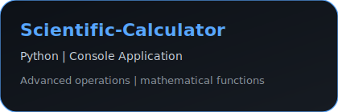
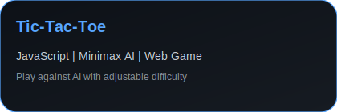

<h1 align="center">
  
</h1>

  <h5 align="center">
    <code><a href="https://www.linkedin.com/in/mohamedwalid0/" title="LinkedIn Profile"> LinkedIn</a></code>
    <code><a href="https://codeforces.com/profile/Mohamed_Walid11" title="CodeForces Profile"> CodeForces</a></code>
    <code><a href="https://leetcode.com/u/MohamedWalid11/" title="LeetCode Profile"> LeetCode</a></code>
  </h5>
  
   
  

    Hi, I'm Mohamed Waleed, Computer Science student from Egypt
     
     
    🔬 I'm currently studying Computer Science at Cairo University
     
    💻 I love writing code and learn anythings about it
     
    📚 I’m currently learning Full-Stack Development
     
    📫 How to reach me: <a href="mailto: mohamedwa904@gmail.com">mohamedwa904@gmail.com</a>
  

<h2 align="center">🔥 Languages & Frameworks & Tools & Abilities 🔥</h2>
 

  <code></code>
  <code></code>
  <code></code>
  <code></code>
  <code></code>
  <code></code>
  <code></code>
  <code></code>
  <code></code>
  <code></code>
  <code></code>

<h2 align="center">📊 LeetCode Card</h2>

  

<h2 align="center">⚡ Stats ⚡</h2>
 

  
  

 

<h2 align="center">👨‍💻 Repositories 👨‍💻</h2>

  
  
   
  
  

<!--
**zumrudu-anka/zumrudu-anka** is a ✨ _special_ ✨ repository because its `README.md` (this file) appears on your GitHub profile.

Here are some ideas to get you started:

- 🔭 I’m currently working on ...
- 🌱 I’m currently learning ...
- 👯 I’m looking to collaborate on ...
- 🤔 I’m looking for help with ...
- 💬 Ask me about ...
- 📫 How to reach me: ...
- 😄 Pronouns: ...
- ⚡ Fun fact: ...

Notes: If you want use this readme, firstly star it please. If you can't align your repositories like this, please change your repository desription to shorter than now. Maybe 4 or 5 word will be good.

-->
